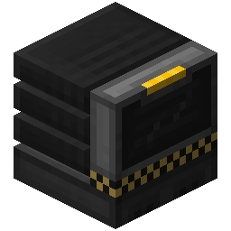
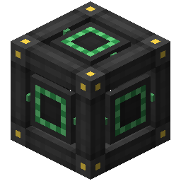
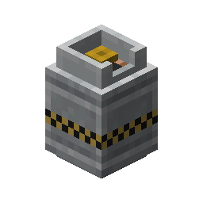
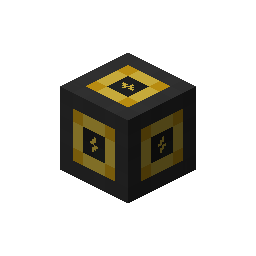
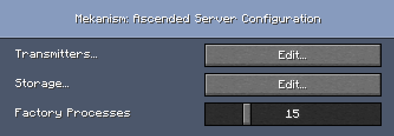
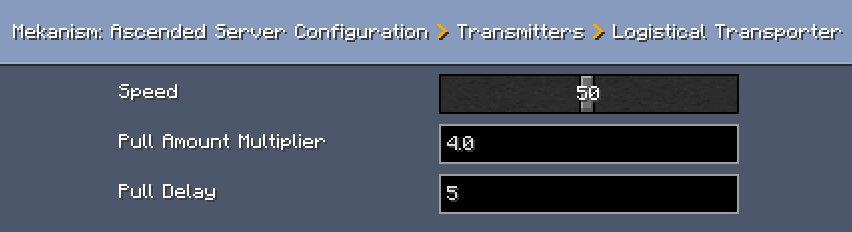

# Mekanism: Ascended

Mekanism: Ascended is a NeoForge addon for [Mekanism](https://github.com/mekanism/mekanism) that extends the late-game tier progression beyond Ultimate with Ascended technology.

The mod adds a new Ascended tier for core Mekanism systems, including storage, transport, factories, and induction multiblocks. It is built for players and modpacks that want a stronger post-Ultimate progression path while keeping the gameplay style close to Mekanism.

## Features

- Ascended Universal Cable, Mechanical Pipe, Pressurized Tube, Thermodynamic Conductor, and Logistical Transporter
- Ascended Energy Cube, Fluid Tank, Chemical Tank, Bin, Induction Cell, and Induction Provider
- Ascended factories for smelting, enriching, crushing, compressing, combining, purifying, injecting, infusing, and sawing
- Ascended Tier Installer for upgrading compatible Mekanism machines
- Transcendent Alloy, Ascended Control Circuit, Enriched Nether Star, and Transcendent Essence progression items
- Configurable server-side balance values for capacities, outputs, pull rates, transporter speed, and factory process count
- Configurable client-side Ascended tier text color and fluid tank render color

   

## Configuration

Configuration files are generated under `config/MekanismAscended/`.

- `client.toml` controls visual options such as Ascended text color and Ascended Fluid Tank color.
- `server.toml` controls balance options for transmitters, storage blocks, induction components, bins, and factories.

Mekanism: Ascended is designed to be easy to tune for different packs and playstyles. Factory process count, transmitter rates, storage capacities, tank outputs, pull amounts, and transporter behavior can all be changed through the server config.

These values can also be adjusted in game through NeoForge's mod configuration screen when supported by your mod setup, making it easy to rebalance the Ascended tier without editing recipes or rebuilding the mod.

 

## Modpacks

You may include Mekanism: Ascended in modpacks.

I’d appreciate it if the mod is downloaded through [CurseForge](www.curseforge.com/minecraft/mc-mods/mekanismascended) or [Modrinth](https://modrinth.com/mod/mekanismascended), since that helps support me. It is not required, though.

## Feedback

If you have ideas for improving Mekanism: Ascended, feel free to leave your suggestions or feedback by opening an issue or writing a comment on the project page.
